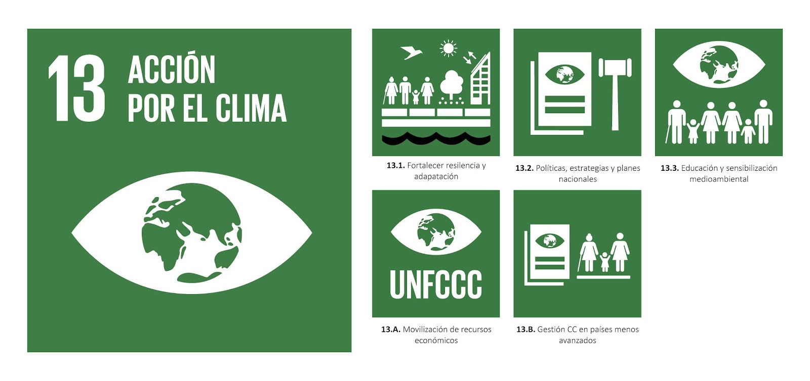

# Objetivo del ODS 13 y su relación con la tecnología

El objetivo de la ODS 13 es adoptar medidas urgentes para combatir el cambio climático y sus efectos.

Podemos servirnos de la IA, big data y los satélites para medir y predecir los fenómenos climáticos. Además, este ODS ayuda a reducir emisiones mediante las energías limpias y  la eficiencia, facilita la digitalización de procesos para reducir residuos y consumo y mejora la gestión de recursos(agua,energía, transporte).

## Problemas a los que se enfrenta esta ODS y soluciones tecnológicas

| **Problemas** | **Impactos** | **Soluciones tecnológicas** |
| - | - | - |
| **El aumento de las emisiones de CO2 y gases de efecto invernadero** | Calentamiento global acelerado, fenómenos climáticos extremos, deshielo y aumento del nivel del mar | CCS(Captura y almacenamiento de carbono), energías renovables, optimización energética, movilidad sostenible |
| **Pérdida de biodiversidad y degradación de ecosistemas** | Colapso de servicios ecosistémicos, extinción de especies, inestabilidad ecológica | Monitoreo con sensores y satélites, drones para reforestación, IA para la conservación, biotecnología |
| **Fenómenos meteorológicos extremos** | Pérdidas humanas y económicas, migraciones climáticas forzadas y colapso de infraestructuras y servicios básicos | Modelos climáticos con IA, satélites meteorológicos, apps de alerta temprana y robótica y drones de emergencia |

## Proyectos y empresas

- **Empresas:** [Tesla](https://www.tesla.com/es_es), [Endesa](https://www.endesa.com/es), [The Ocean Cleanup](https://theoceancleanup.com/), [NASA Climate Change](https://climate.nasa.gov), [IRENA](https://www.irena.org)  

- **Proyectos:** [Copernicus](https://www.copernicus.eu), [RE100](https://www.there100.org/)

## Indicadores y métricas que se pueden usar para medir el progreso hacia esta ODS  

#### Indicadores:  

1. **13.1.1:** Números de muertos por desastres naturales
2. **13.2.1:** Existencia de políticas climáticas nacionales integradas
3. **13.3.1:** Nivel de educación y capacitación climática
4. **13.a.1:** Financiación aportada a países en desarrollo

#### Métricas:  

1. Emisiones de CO2 per capita
2. Porcentaje de energía renovable sobre total
3. Superficie forestal protegida
4. Intensidad energética de un país
5. Número de eventos climáticos extremos anuales
6. Cantidad de residuos electrónicos reciclados.

## Otros ODS relacionados

> La [ODS 14](https://rgoncar723.github.io/SASP_Fase1_Web/ods/) (Vida submarina), se le relaciona con esta ODS porque el aumento de temperaturas y la acidificación del océnao afectan gravemente los ecosistemas marinos.

> La [ODS 12](https://ftorsuc2608.github.io/SASP_Fase1_AmpliacionContenido/#ods12-ProduccionYConsumo/)(Producción y consumo sostenibles), los procesos industriales y el consumo excesivo generan emisiones que alimentan el cambio climático. Reducirlas mediante prácticas sostenibles (ODS 12) contribuye directamente a los objetivos del ODS 13.

> La [ODS 4](https://ftorsuc2608.github.io/SASP_Fase1_AmpliacionContenido/#ods04-EducacionDeCalidad/)(Educación de calidad)Una población educada entiende mejor los riesgos climáticos y puede actuar de forma responsable en su consumo, transporte y hábitos diarios.