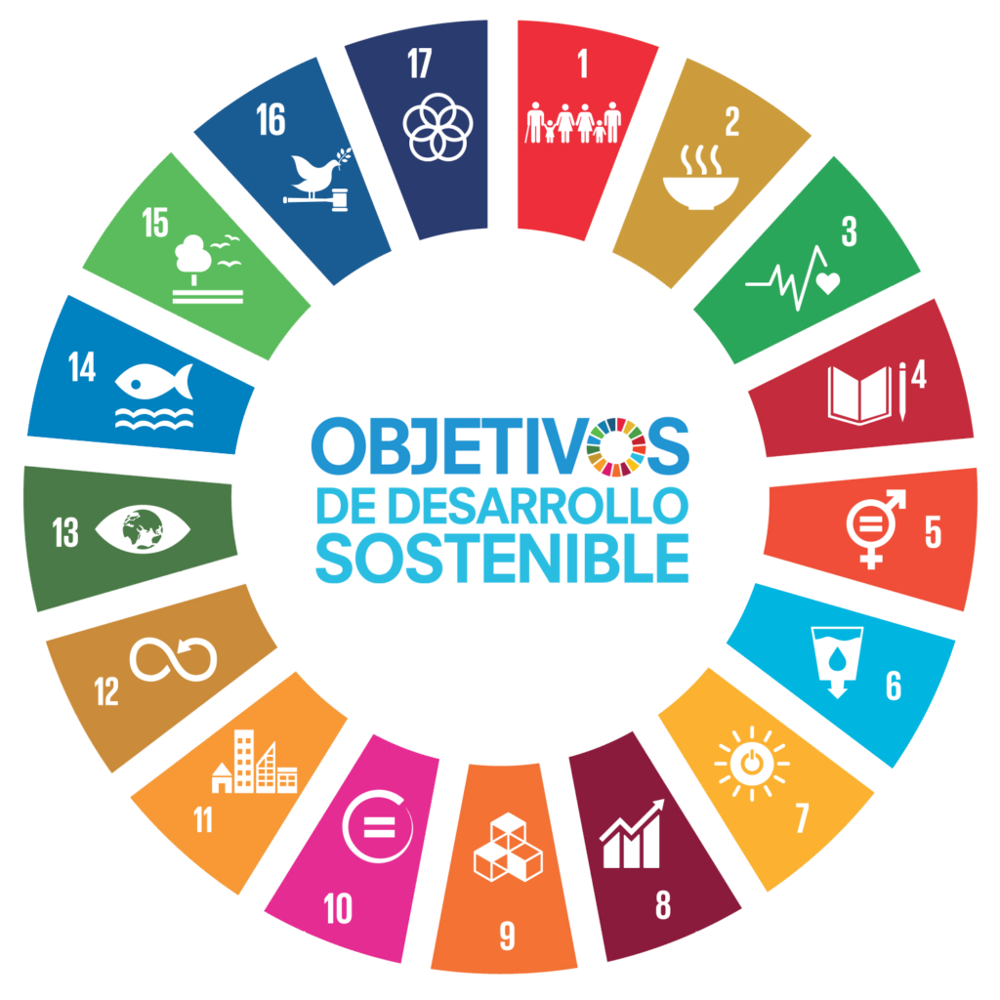

# Sostenibilidad

## Introducción

La **sostenibilidad** se refiere a diseñar, desarrollar e implementar tecnologías de manera que se minimice su impacto ambiental, promueva el uso eficiente de recursos y apoye la equidad social a largo plazo.
En el sector tecnológico actual sirve para mitigar el impacto ambiental de la industria y fomentar un desarrollo más equilibrado con el planeta, es decir, incita a las empresas a seguir prácticas sostenibles, con las cuales se contribuye a la reducción de residuos electrónicos, al uso eficiente de la energía y la adopción de tecnologías renovables.

## Dimensiones que abarca la sostenibilidad

1. **La sostenibilidad ambiental**: Se centra en proteger y restaurar los ecosistemas, conservar la biodiversidad y reducir la contaminación, adoptando prácticas de consumo responsable, promoviendo la eficiencia energética, el desarrollo de energías renovables y la gestión de residuos de manera adecuada.

   
2. **La sostenibilidad social**: Se centra en la equidad, la justicia social, el acceso a la educación, la salud y otros servicios básicos, así como la inclusión y respeto a la diversidad cultural. Su objetivo es crear una sociedad donde todos podamos vivir una vida digna y desarrollarnos como personas.

3. **La sostenibilidad económica**: Se enfoca en la viabilidad a largo plazo de las actividades económicas, promoviendo el crecimiento inclusivo, la eficiencia en el uso de los recursos y la innovación tecnológica.

## Los aspectos ASG
### ¿Qué son los aspectos ASG?  

 Los aspectos ASG son un conjunto de estándares que miden el comportamiento sostenible y ético de una empresa en tres áreas clave:

1. **Ambiental(A):** Analiza el impacto de la empresa sobre el medio ambiente(gestión de residuos, uso de energía, emisiones de carbono)

2. **Social(S):** Evalúa el trato al trabajador, la diversidad, la equidad, las condiciones laborales y las relaciones con la comunidad.

3. **Gobernanza(G):** Examina la transparencia, la ética empresarial, la composición del consejo directivo y las prácticas de cumplimiento normativo.

Esto les interesa a las empresas porque además de mejorar la reputación corporativa reduce los riesgos y aumenta la competitividad. Por si fuera poco, actualmente los inversores, clientes y empleados priorizan las empresas que cumplen los aspectos ASG.

## Marcos internacionales que impulsan la sostenibilidad

- **La agenda 2030:** Un plan de acción universal para erradicar la pobreza, proteger el planeta y garantizar la paz y prosperidad para todos.

- **Las ODS:** 17 objetivos de desarrollo sostenibles que deben completarse para el año 2030, incluyendo temas como la acción por el clima, la igualdad de género,etc.

- Las tres ODS más relacionadas con la informática son:   

| ODS | Relación con la tecnología |
| - | - |
| **ODS 7: Energía asequible y no contaminante** | Uso de estas para mejorar baterías, sistemas de almacenamiento y mejorar la eficiencia energética en edificios, industria y transporte. |
| **ODS 8: Trabajo decente y crecimiento económico** | La industria 4.0, IA, ciberseguridad, teletrabajo, nuevos empleos de programación. |
| **ODS 9: Industria, innovación e infraestructura** | Desarrollo del 5G, la fibra óptica, la impresión 3D, la IA y la creación de industrias más sostenibles y eficientes. |
